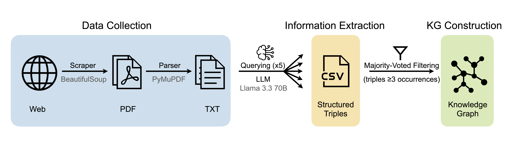

<p align="center">
  
</p>
<h1 align="center">MEDAKA: Construction of Biomedical Knowledge Graphs Using Large Language Models</h1>

<div align="center">
  <a href="https://github.com/medakakg/medaka/raw/main/dataset/medaka.zip" download>
    
  </a>
</div>


---

## Table of Contents

| [TL;DR](#tldr) | [Features](#features) | [Pipeline](#pipeline) | [Description](#description) | [Installation](#installation) | [Usage](#usage) |

---

<a name="tldr"></a>
## ⚡ TL;DR [[Back to Top]︎](#table-of-contents)

We introduce a two-fold contribution:

1️⃣ A **hackable, end-to-end pipeline** for automatically constructing KGs from unstructured text using a **web scraper and an LLM**.  
2️⃣ A **curated dataset** generated by applying this method to publicly available **drug leaflets** sourced from online pharmacies — capturing drug-centric attributes often missing in existing biomedical KGs.

**[Download the latest version of MEDAKA](https://github.com/medakakg/medaka/raw/main/dataset/medaka.zip)** to explore clinically relevant information beyond molecular data.

### <a name="figure-1-pipeline"></a>
<p align="center">
  
</p>
<em>Figure 1: Pipeline</em>

---

<a name="features"></a>
## ✨ Features [[Back to Top]︎](#table-of-contents)

- **End-to-End KG Pipeline:**  A modular and hackable pipeline that extracts structured knowledge from unstructured text using a web scraper and an LLM. 

- **Drug Leaflet-Centric Knowledge Graph:**  *MEDAKA* is constructed from 13,000+ drug leaflets sourced from the HPRA website, capturing real-world, clinical data important for both patients and medical practitioners.

- **LLM-Based Information Extraction with Majority Voting:** Utilizes **LLaMA 3.3 70B Instruct** model for prompt-based extraction of subject–relation–object triples directly from full-text PDFs. Each leaflet is queried multiple times, and triples occurring at least 3 times are retained, boosting precision and reducing LLM hallucination.

- **Ready-to-Use Dataset:** *MEDAKA* can be [downloaded](https://github.com/medakakg/medaka/raw/main/dataset/medaka.zip) in a ready-to-use CSV format.

- **Broader Clinical Coverage:**  Captures practical features often missing in other biomedical KGs and databases, including storage information, physical appearance (shape, color), and inactive ingredients.

- **Generalizable & Open Source:**  The pipeline is reusable and adaptable across domains and document types, and the full codebase is open source.

---

<a name="pipeline"></a>
## 🧬 Pipeline [[Back to Top]︎](#table-of-contents)

We present an end-to-end pipeline for constructing a biomedical knowledge graph from unstructured drug leaflet data.

- The process begins with **data collection**, where drug leaflets are scraped from online pharmacies using a Python-based web scraper and converted into machine-readable text.

- The raw text is then processed using a **prompt-based approach with an LLM**, queried multiple times to extract drug-related entities and relationships as subject–relation–object triples.

- A **majority voting step** retains only triples occurring three or more times across generations, ensuring consistency and reliability.

- The validated triples are transformed into **graph nodes and labeled edges**. This structured data is exported in **CSV format**, forming the MEDAKA KG.

> 📌 *[Figure 1](#figure-1-pipeline) above shows a visual overview of the pipeline, highlighting each step from raw data collection to graph construction.*
---

<a name="description"></a>
## 📊 Description [[Back to Top]︎](#table-of-contents)

As a demonstration of our general pipeline for the construction of KGs, we implemented and evaluated a case study focused on drug leaflets. The resulting KG, MEDAKA consists of  41,142 nodes and 466,359  directed, labeled edges. The following *[Figure 2](#figure-2)* and *[Figure 3](#figure-3)* show the distribution of various entity types and relation types in the dataset.

<a name="figure-2"></a>
<a name="figure-3"></a>
<table width="100%">
  <tr>
    <td align="center" width="50%">
      <br>
      <em>Figure 2: Entity Type Distribution</em>
    </td>
    <td align="center" width="50%">
      <br>
      <em>Figure 3: Relation Type Distribution</em>
    </td>
  </tr>
</table>

---

<a name="installation"></a>
## Installation [[Back to Top]︎](#table-of-contents)

Follow these steps to set up the project locally:

### 1. Clone the repository
```bash
git clone https://github.com/medakakg/medaka.git
cd medaka
```

### 2. Create and activate virtual environment
Choose one of the following:

- **Option A: Using `venv`**
```bash
python3 -m venv env
source env/bin/activate  # On Windows: env\Scripts\activate
```
- **Option B: Using `conda`**
```bash
conda create --name medaka-env python=3.10
conda activate medaka-env
```

### 3. Install dependencies
```bash
pip install -r requirements.txt
```

---

<a name="usage"></a>
## Usage [[Back to Top]︎](#table-of-contents)
The pipeline is divided into multiple stages for modular processing:

### 1. Data Scraping
- **Step 1: Extract Source Code**
```bash
python scripts/scrape_html_sources.py
```
Scrapes the [HPRA website](https://www.hpra.ie) using BeautifulSoup and extracts source code with links to drug leaflet pages. You may use a scraper of your choice.
- **Step 2: Download PDFs from Extracted URLs**
```bash
python scripts/download_pdfs.py --rtf_path ./sourcecode.rtf --output_folder ./data
```
Downloads the actual drug leaflet PDFs based on the extracted page source code.

### 2. Information Extraction Using LLM
- **Step 3: Extract Structured Triples from PDFs**
```bash
python scripts/extract_information.py \
  --pdf-dir ./data \
  --output-csv ./medaka.csv \
  --processed-log ./processed_files.txt \
  --cache-dir ./cache \
  --api-url <your_llm_url> \
  --model-name <your_model_name> \
  --api-key <your_api_key>
```
Uses an LLM (e.g., LLaMA 3 70B Instruct) to extract drug-related information using prompts in the form of  structured biomedical triples (drug name, relation, object). It applies majority voting across multiple generations to improve reliability, assigns confidence scores, converts triples to lowercase, removes duplicates and writes results into a CSV file. Replace the LLM arguments with your preferred model and endpoint.


### 3. Knowledge Graph Construction
- **Step 4: Filter triples based on confidence scores**
```bash
python scripts/filter_triples.py \
  --input-csv ./medaka.csv \
  --output-csv ./medaka_filtered.csv \
  --threshold 0.5
```
Refines the extracted triples by filtering them based on the confidence score assigned during majority voting. Only triples with Confidence greater than or equal to the specified threshold (default: 0.5) are kept. The result is a cleaned CSV containing high-confidence triples, forming the KG, Medaka.

---

### Graph Statistics
```bash
python scripts/medaka_stats.py --input-csv ./medaka_filtered.csv
```
Explores key graph statistics of MEDAKA including:
- Node & edge counts
- Predicate-wise statistics
- Degree distributions, graph connectivity, betweenness centrality and assortativity
- Top drugs based on the count of relations

---

### LLM-as-Judge Evaluation
```bash
python scripts/llm_eval.py \
  --input-txt ./Medaka_Validation_Triples.txt \
  --pdf-dir ./data \
  --out-csv ./Medaka_Triples_Validated.csv \
  --pdf-suffix .pdf \
  --temperature 0.0 \
  --max-tokens <enter_numeric_value> \
  --max-triples-per-call <enter_numeric_value> \
  --max-leaflet-chars <enter_numeric_value> \
  --api-url <your_llm_url> \
  --model-name <your_model_name> \
  --api-key <your_api_key>
```
This step is part of the evaluation process which validates a set of random triples against the original leaflet PDFs using an LLM-as-Judge framework. Each triple is labeled as Correct, Incorrect, or Partially Correct, with a short reasoning grounded in the leaflet text. Results are saved to a CSV file.
